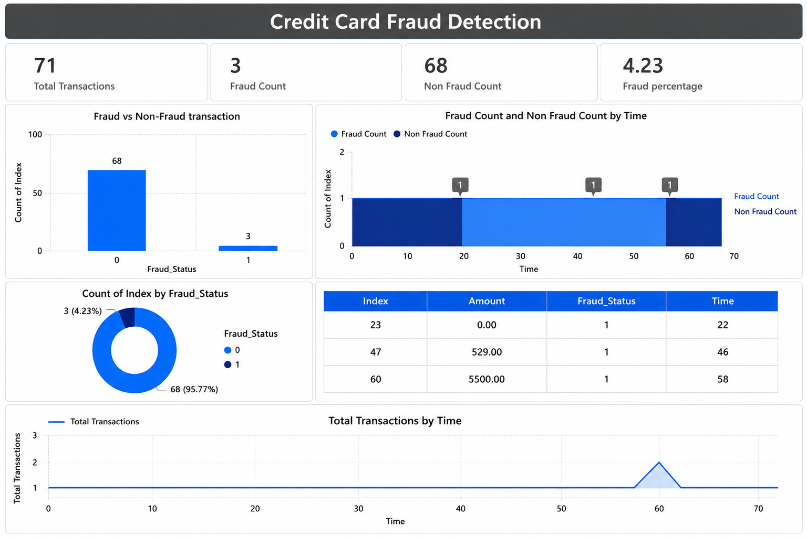

# Credit Card Fraud Analysis using Power BI


## 📊 Project Overview

This project analyzes credit card transaction data to identify and understand fraudulent transaction patterns using **Power BI**.

The project was developed as an **academic class project for the subject Introduction to Data Analytics (IDA)**. The analysis focuses on data cleaning, transformation, exploratory analysis, and interactive visualization of credit card transactions.

## 🎯 Objectives

* Analyze credit card transaction data.
* Identify fraudulent and legitimate transaction patterns.
* Clean and transform the dataset using Power Query.
* Create meaningful KPIs and visualizations.
* Analyze transaction trends and fraud distribution.
* Present insights through an interactive Power BI dashboard.

## 🛠️ Tools & Technologies

* **Power BI Desktop**
* **Power Query**
* **DAX**
* **CSV / Excel**
* **Git & GitHub**

## 📁 Project Structure

```text
Credit-Card-Fraud-Analysis/
│
├── Credit-Card-Fraud-Analysis.pbix
├── Dashboard.png
│
├── dataset/
│   ├── Cleaned_credit_data.csv
│   └── compressed_creditcard_data.csv
│
└── docs/
    └── Project_Report.pdf
```

## 🧹 Data Preparation

The dataset was prepared using Power Query before visualization.

Major preprocessing steps included:

* Importing the transaction dataset.
* Checking and correcting data types.
* Cleaning the dataset.
* Renaming relevant columns for better readability.
* Creating transaction-related fields.
* Adding an index for maintaining row order.
* Preparing a compressed dataset for academic project usage.

## 📈 Dashboard

The Power BI dashboard presents visual insights into credit card transactions, including fraud-related analysis and transaction trends.

### Dashboard Preview



## 📊 Dataset

The original dataset was obtained from Kaggle:

**Kaggle Dataset:**
<https://www.kaggle.com/datasets/mlg-ulb/creditcardfraud>

The repository also contains cleaned and compressed versions of the dataset used during the academic analysis.

## 📋 Project Files

### Power BI Report

`Credit-Card-Fraud-Analysis.pbix`

Contains the complete Power BI report, data transformations, visualizations, and dashboard.

### Dataset

The `dataset` folder contains:

* `Cleaned_credit_data.csv` — cleaned dataset used for analysis.
* `compressed_creditcard_data.csv` — smaller dataset prepared for academic project usage.

### Project Report

`docs/Project_Report.pdf`

Contains the detailed academic documentation and analysis of the project.

## 🔍 Key Areas of Analysis

The project explores:

* Total transaction activity.
* Fraudulent vs. non-fraudulent transactions.
* Transaction trends over time.
* Fraud transaction details.
* Distribution of transaction categories.
* Patterns that can help understand fraudulent activity.

## 💡 Skills Demonstrated

This project demonstrates practical experience in:

* Data Cleaning
* Data Preprocessing
* Power Query
* Data Transformation
* Exploratory Data Analysis
* Data Visualization
* Dashboard Development
* DAX
* Business-oriented Data Interpretation
* Git & GitHub

## 🎓 Academic Context

**Subject:** Introduction to Data Analytics (IDA)

**Project Type:** Academic Class Project

**Domain:** Financial Data Analytics / Fraud Detection

The project was completed as part of a team-based academic assignment.


## 📌 Note

This repository contains an academic project created for learning and demonstration purposes. The analysis is intended to demonstrate data analytics and visualization techniques rather than serve as a production fraud detection system.

## ⭐ Acknowledgements

The dataset used for this academic analysis was obtained from the publicly available Kaggle **Credit Card Fraud Detection** dataset.
